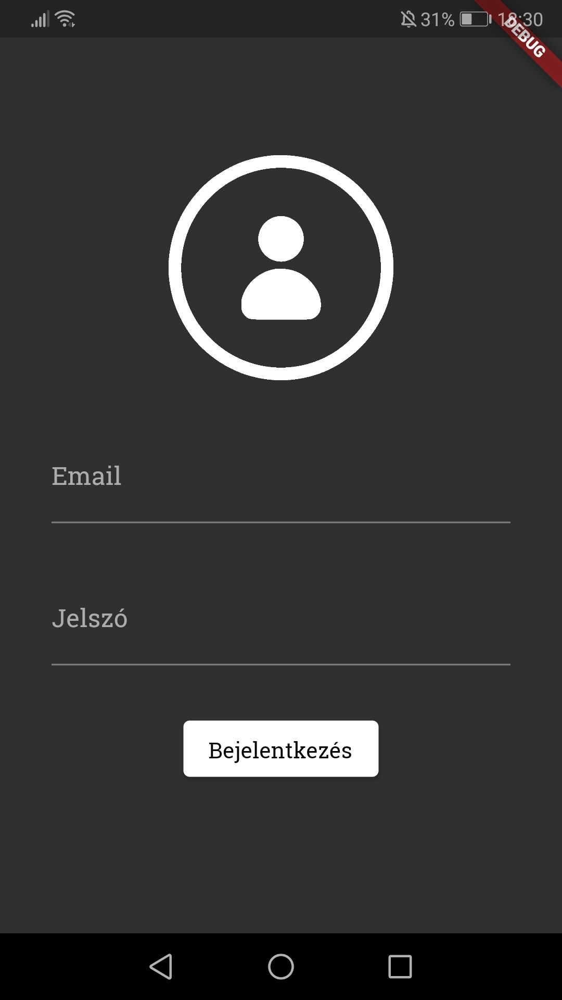
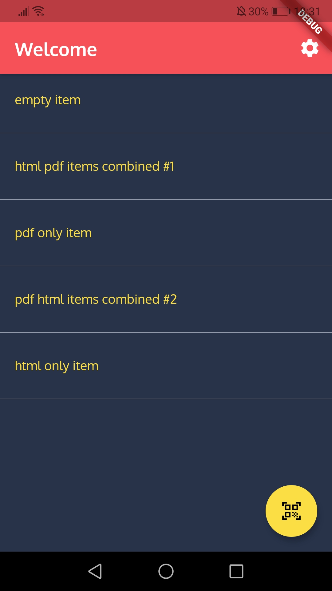
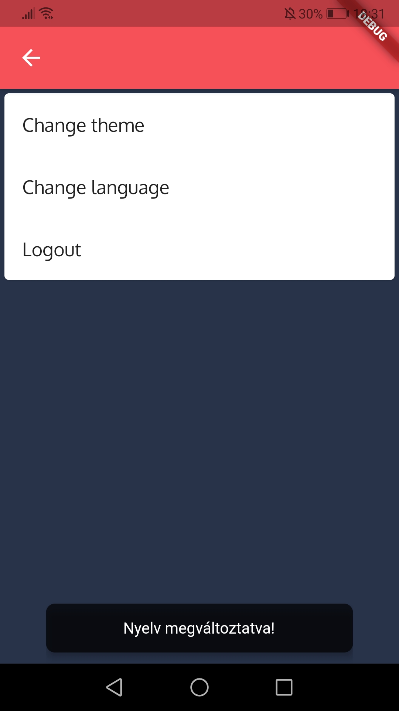
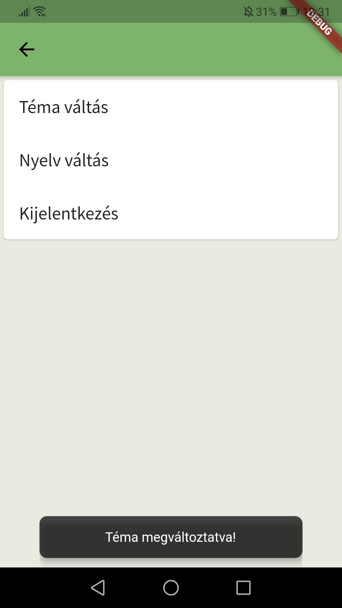
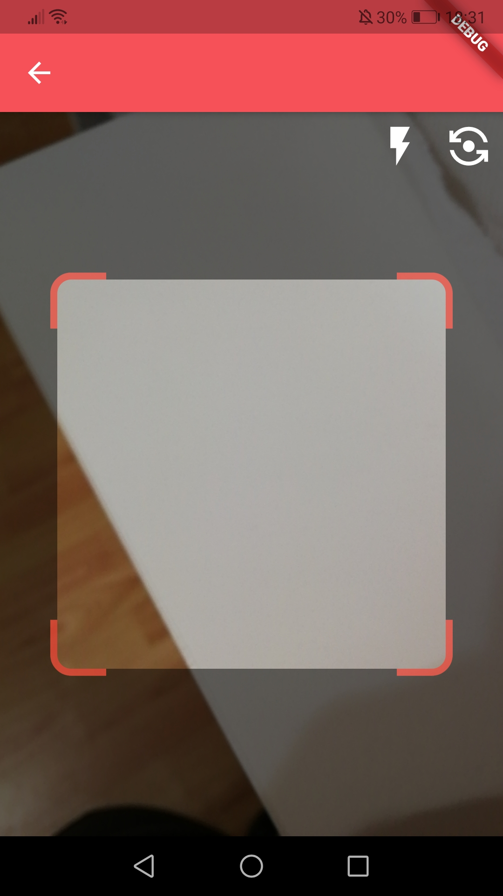
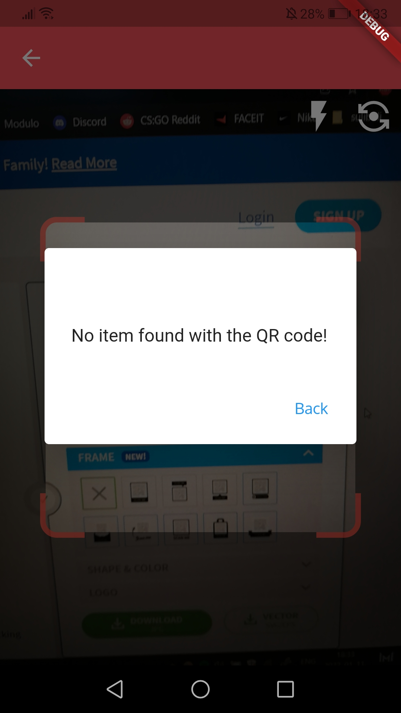
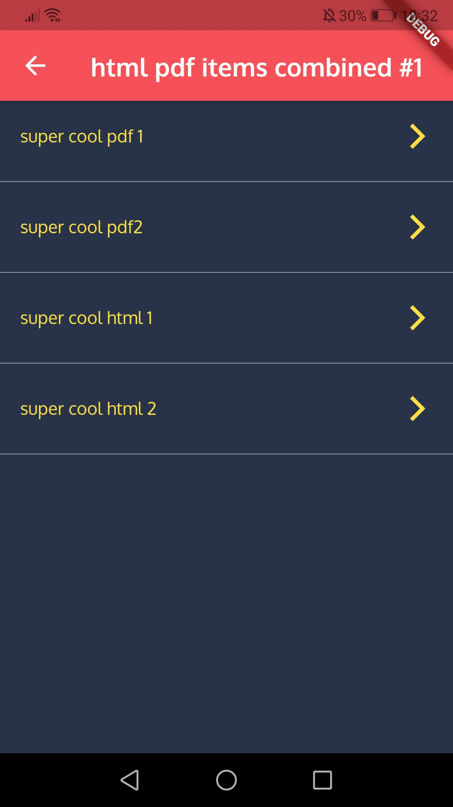
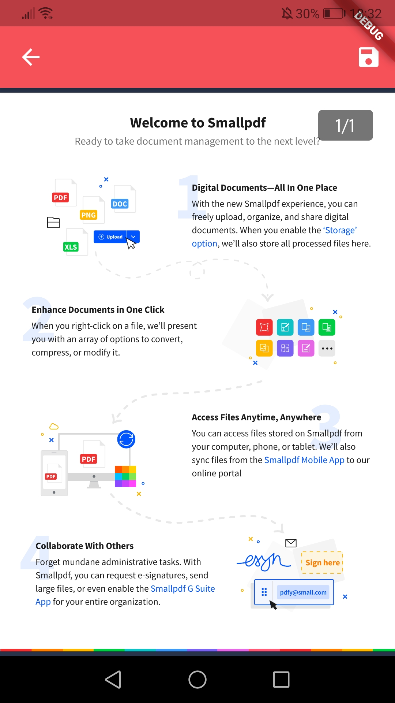
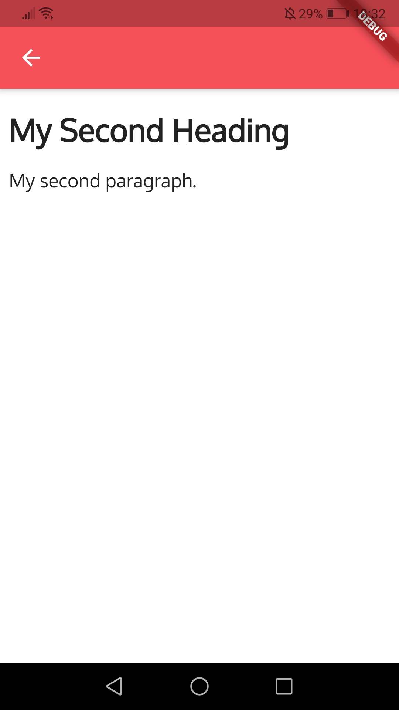
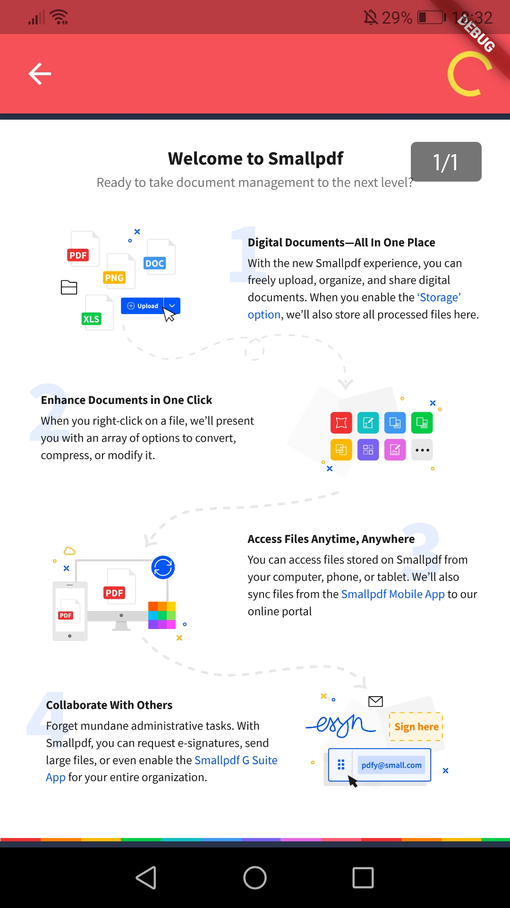

# JPTAPP

A JPTApp az első alkalmazásom amit az ICB Tech-nél a szakmai gyakrolaton készítettem.
Az alkalmazás célja a Firebase backend létrehozása, majd ennek alkalmazása Flutter alkalmazásban

A backendhez Firebase Realtime Database lett használva és az adatok JSON formátumban voltak használva.

Alap követelmények az alábbiak voltak:
* Legyenek az engedélyek kezelve
* Legyenek a sikertelen kérések kezelve
* Legyenek a hálózati hibák kezelve
* A Firebase adatbázissal a kommunikáció REST protocolon keresztül legyen megvalósítva

# Müködés

* Teszt email: test@test.com
* Teszt jelszó: testpw

A teszt email és jelszó segítségével jelentkezhetünk be az alkalmazásba. Az autentikációról a Firebase Authentication gondoskodik. Sikeres bejelentkezés után a kezdőképernyőre kerülünk. A kezdőképernyőn különböző "item"-ek találhatóak amelyek tartalmaznak pdf és html-eket, ami a Firebase adatbázisból a GET segítségével megkaptunk.

 

A beállításokban tudunk témát illetve nyelvet váltani. Angol és magyar nyelv és három különböző téma érhető el. A témák esetében mindegyik különbözőek a betűtípusok és a színkombinációk.

 

Az adott "item"-et QR kód segítségével is beolvashatjuk, azaz ha a QR kódban lekódolt item név szerepel az adatbázisban, akkor átdob az adott item-re alkalmazás. A kezdőképernyőn a bal alsó sarokban lévő ikonnal tudjuk elérni a QR olvasót.

  

Az item-en belül pedig a konkrét pdf és html fájlok listázódnak ki. Ezekre rákoppintva megtudjuk őket jeleníteni.

 

A pdf-ek a jobb felső sarokban elhelyezkedő mentés gomb megnyomására menthetőek a mobileszközre. 

